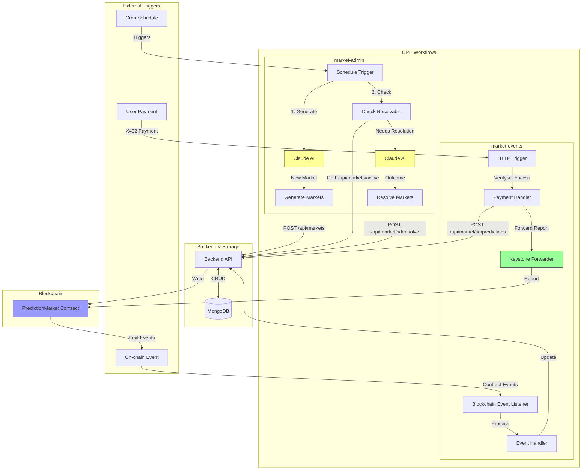

# Predict AI CRE Workflows

Chainlink Runtime Environment workflows for the Predict AI platform. Consists of two workflows:

1. **market-admin** - Scheduled workflow for market generation and resolution using Claude AI
2. **market-events** - Event-driven workflow for payment processing and on-chain event handling

## Quickstart

```bash
# market-admin workflow (scheduled)
cd cre/market-admin
npm install
npm run simulate

# market-events workflow (HTTP trigger + events)
cd ../market-events
npm install
npm run simulate
```

## Workflow Architecture



## Workflows

### market-admin

**Purpose:** Automated market lifecycle management using Claude AI

**Triggers:**

- Scheduled execution (configurable cron)

**Capabilities:**

1. **Market Generation**
   - Claude generates interesting prediction markets
   - Creates markets via Backend API (`POST /api/markets`)
   - Stores in MongoDB for user access

2. **Market Resolution**
   - Checks for markets past deadline (`GET /api/markets/active`)
   - Claude researches and determines outcomes
   - Resolves markets via API (`POST /api/market/:id/resolve`)
   - Triggers on-chain settlement

**Configuration:**

- `config.staging.json` / `config.production.json`
- Requires: `CLAUDE_API_KEY` (via CRE secrets)
- Schedule configurable per environment

**Files:**

- `main.ts` - Workflow entry point and trigger handling
- `generationHandler.ts` - Market generation logic with Claude
- `resolutionHandler.ts` - Market resolution logic with Claude
- `workflow.yaml` - CRE workflow configuration

### market-events

**Purpose:** Real-time event processing for payments and blockchain events

**Triggers:**

- HTTP requests (X402 payment notifications from backend)
- On-chain events (contract events from Base L2)

**Capabilities:**

1. **Payment Processing**
   - Receives X402 payment notifications
   - Verifies payment authenticity
   - Records prediction via API (`POST /api/market/:id/predictions`)
   - Forwards report to Keystone Forwarder for on-chain recording

2. **Event Monitoring**
   - Listens for contract events (MarketCreated, MarketResolved, etc.)
   - Processes and logs events
   - Updates backend state as needed

**Configuration:**

- `config.staging.json` / `config.production.json`
- Requires: `chainSelectorName`, `contractAddress`, `authorizedEVMAddress`
- HTTP trigger with authentication

**Files:**

- `main.ts` - Workflow entry point and trigger routing
- `paymentHandler.ts` - X402 payment processing
- `eventHandler.ts` - Blockchain event processing
- `workflow.yaml` - CRE workflow configuration

## Project Structure

```
cre/
├── project.yaml              # CRE project settings (RPCs, chains)
├── secrets.yaml              # Secret mappings (API keys, credentials)
├── market-admin/             # Scheduled workflow
│   ├── main.ts               # Entry point
│   ├── generationHandler.ts  # Market generation with Claude
│   ├── resolutionHandler.ts  # Market resolution with Claude
│   ├── workflow.yaml         # Workflow config
│   ├── config.staging.json   # Staging configuration
│   └── config.production.json# Production configuration
├── market-events/            # Event-driven workflow
│   ├── main.ts               # Entry point
│   ├── paymentHandler.ts     # Payment processing
│   ├── eventHandler.ts       # Event handling
│   ├── workflow.yaml         # Workflow config
│   ├── config.staging.json   # Staging configuration
│   └── config.production.json# Production configuration
└── scripts/                  # Testing utilities
    └── check-data.ts         # Balance checker
```

## Deployment

### Prerequisites

1. **Install CRE CLI:**

   ```bash
   npm install -g @chainlink/cre-cli
   ```

2. **Configure Secrets:**
   Edit `secrets.yaml` to map secret names to environment variables:

   ```yaml
   secrets:
     CLAUDE_API_KEY: ${CLAUDE_API_KEY}
     BACKEND_API_KEY: ${BACKEND_API_KEY}
     MONGODB_URI: ${MONGODB_URI}
   ```

3. **Set Environment Variables:**
   ```bash
   export CLAUDE_API_KEY="sk-ant-..."
   export BACKEND_API_KEY="your-api-key"
   export MONGODB_URI="mongodb://..."
   ```

### Deploy Workflows

**Deploy market-admin (staging):**

```bash
cd cre/market-admin
npm run deploy
# or manually
cre workflow deploy staging-settings
```

**Deploy market-admin (production):**

```bash
cd cre/market-admin
npm run deploy:prod
# or manually
cre workflow deploy production-settings
```

**Deploy market-events (staging):**

```bash
cd cre/market-events
npm run deploy
# or manually
cre workflow deploy staging-settings
```

**Deploy market-events (production):**

```bash
cd cre/market-events
npm run deploy:prod
# or manually
cre workflow deploy production-settings
```

### Verify Deployment

After deploying, verify workflows are running:

```bash
# List all workflows
cre workflow list

# Check specific workflow status
cre workflow status <workflow-id>

# View workflow logs
cre workflow logs <workflow-id>
```

## Local Simulation

Test workflows locally before deploying:

```bash
# Simulate market-admin
cd cre/market-admin
npm run simulate

# Simulate market-events
cd cre/market-events
npm run simulate
```

Simulation uses `config.staging.json` by default and runs without deploying to CRE.

## Configuration

### project.yaml

Defines RPC endpoints and chain configurations for all workflows:

```yaml
staging-settings:
  rpcs:
    - chain-name: ethereum-testnet-sepolia-base-1
      url: https://base-sepolia-rpc.publicnode.com

production-settings:
  rpcs:
    - chain-name: ethereum-mainnet-base-1
      url: https://base-rpc.publicnode.com
```

### workflow.yaml

Each workflow has its own `workflow.yaml` defining:

- Workflow name
- Config and secrets paths
- Environment-specific settings

### Environment Configs

Each workflow has two config files:

- `config.staging.json` - Base Sepolia testnet
- `config.production.json` - Base mainnet

**market-admin configs:**

```json
{
  "schedule": "0 */6 * * *", // Every 6 hours
  "backendUrl": "http://localhost:4021",
  "generateMax": 5, // Max markets to generate
  "resolveMax": 10 // Max markets to resolve
}
```

**market-events configs:**

```json
{
  "chainSelectorName": "ethereum-testnet-sepolia-base-1",
  "contractAddress": "0x...", // PredictionMarket contract
  "authorizedEVMAddress": "0x...", // Authorized forwarder
  "backendUrl": "http://localhost:4021"
}
```

## Monitoring & Debugging

**View Logs:**

```bash
cre workflow logs <workflow-id> --follow
```

**Check Workflow Status:**

```bash
cre workflow status <workflow-id>
```

**List All Workflows:**

```bash
cre workflow list
```

**Delete Workflow:**

```bash
cre workflow delete <workflow-id>
```

## Integration with Backend

Both workflows integrate with the Backend API:

**market-admin calls:**

- `POST /api/markets` - Create generated markets
- `GET /api/markets/active` - Get resolvable markets
- `POST /api/market/:id/resolve` - Resolve markets

**market-events calls:**

- `POST /api/market/:id/predictions` - Record predictions

All calls require `x-api-key` header with value from `secrets.yaml`.

## Integration with Contracts

**market-events** forwards reports to the Keystone Forwarder which calls:

- PredictionMarket contract on Base L2
- Records predictions on-chain
- Emits events for tracking

## Troubleshooting

**Issue: Workflow not triggering**

- Check schedule in config file
- Verify workflow is deployed: `cre workflow list`
- Check workflow logs: `cre workflow logs <id>`

**Issue: API calls failing**

- Verify `BACKEND_API_KEY` in secrets matches backend `API_KEY`
- Check backend is running and accessible
- Review backend logs for errors

**Issue: Blockchain calls failing**

- Verify `contractAddress` in config is correct
- Check RPC endpoint in `project.yaml`
- Ensure wallet has sufficient gas (ETH)

**Issue: Claude API errors**

- Verify `CLAUDE_API_KEY` in secrets is valid
- Check Claude API rate limits
- Review Claude API usage in Anthropic Console

## Development

**Run TypeScript compilation:**

```bash
npm run build
```

**Run in watch mode:**

```bash
npm run dev
```

**Format code:**

```bash
npm run format
```

## License

MIT
